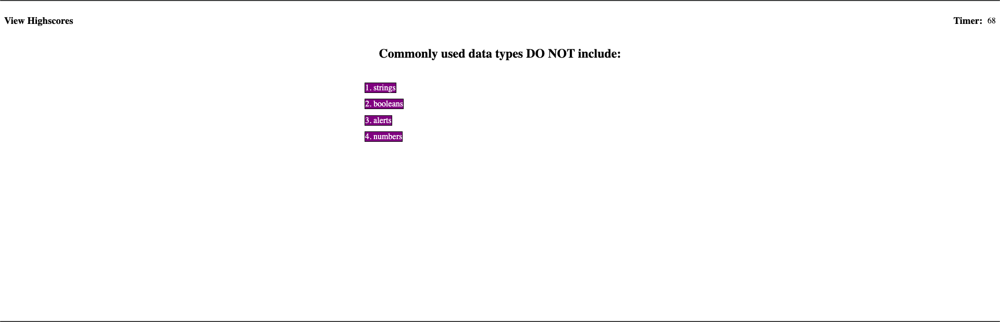
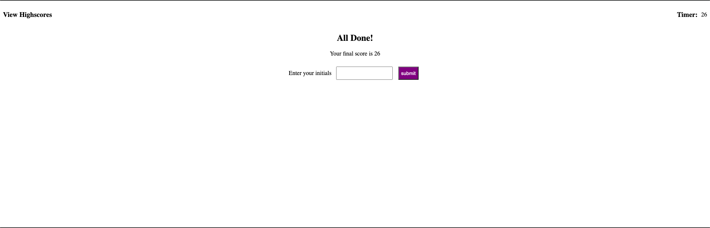
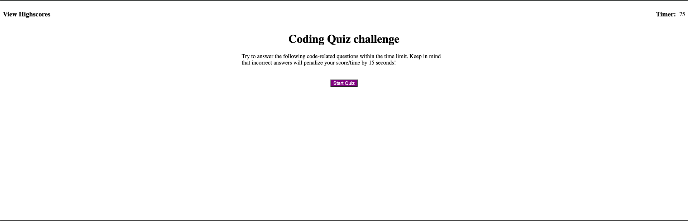

# code-quiz

## Description
For this project, we as web developing, boot camp students, wanted to create a web application that teaches us how to use web apis by showing our knowledge of traversing the dom, writing and reading data in local storage, creating elements dynamically in javascript, writing text to them and appending them to the html file. We can do this because the browser has built in methods that allows us to do all these things. All of this will ultimately help us to practice our skills and make us better coders. The problem that was solved is that we were able to create this game from scratch, writing our own code for the javascript, html, and css files. From that a game was created that asks a user different coding questions and then gives a user their score at the end. The user can also see the different scores that are from previous games in the high score part of the page. 

## Usage
From that a game was created that asks a user different coding questions and then gives a user their score at the end. The user can also see the different scores that are from previous games in the high score part of the page. You can also delete the scores in the high scores area.

## Credits
A tutor helped me in order to find out how to code the local storage part of the app. I also asked the ta many questions about the app and he helped me with different parts of my code I was struggling with.

## Technologies
Html, CSS, JavaScript

## Questions
For any questions, please reach out by creating an issue.

## Deployment Section

